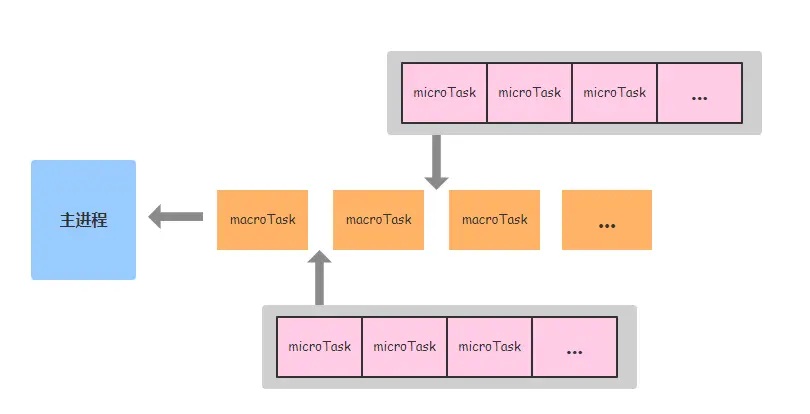

这是一篇汇总前端进阶面试题的文章，希望我能将这些知识汇总到这里，让自己看到后能更加的了解和熟悉这类知识点。

<details open>
<summary>

## Js事件循环(Event Loop)
</summary>


<details>
<summary>

### 浏览器Event Loop
</summary>


JavaScript 有一个基于事件循环（event loop）的并发模型，事件循环负责执行代码、收集和处理事件以及执行队列的子任务。

> javaScript 的运行机制

1. 所有同步任务都在主线程上执行，形成一个**执行栈**
2. 主线程外还有一个 <strong>任务队列</strong>。只要异步任务有了运行结果，就在任务队列中放置一个事件
3. 在 执行栈 中的所有同步任务执行完毕，就会读取 任务队列，看看里面有哪些事件。那些对应的异步任务于是结束等待状态，进入执行栈开始执行。
4. 主线程不断的重复以上三步，直到全部执行完成。
概括：调用栈中的同步任务都执行完毕，栈内被清空，届时主线程空闲了，就回去 任务队列 中按顺序读取一个任务放进栈中执行。每次栈内被清空，都会去读取任务队列，看有没有任务，有就读取执行，一直循环读取-执行的操作。

<br> **一个事件循环中有一个或多个任务队列**

> javaScript 中有两种异步任务
1. **宏任务**（macrotask）：
script（整体代码）、setTimeout、setInterval、setImmediate、I/O、UI rendering、xhr

2. **微任务**（microtask）：
process.nextTick（Nodejs）、Promises、Object.observe、MutationObserver

<br> **同一事件循环tick中微任务总比宏任务先执行**

为了更好的理解 `microtask` 和 `macrotask`，举例下面的代码片段以供理解：
```jsx
// 请给出下面这段代码执行后，log 的打印顺序
console.log('script start')

async function async1() {
  await async2()
  console.log('async1 end')
}
async function async2() {
  console.log('async2 end')
}
async1()

setTimeout(function() {
  console.log('setTimeout')
}, 0)

new Promise(resolve => {
  console.log('Promise')
  resolve()
})
  .then(function() {
    console.log('promise1')
  })
  .then(function() {
    console.log('promise2')
  })

console.log('script end')

// log 打印顺序：
// script start 
// async2 end 
// Promise 
// script end 
// async1 end 
// promise1 
// promise2 
// undefined
// setTimeout
```
为什么会出现上面的顺序问题呢？原因是浏览器会根据任务性质不同，将不同的任务源塞进不同的队列中，由于任务源会分为微任务和宏任务，浏览器对两种不同任务源队列中的毁掉函数的读取机制不同（浏览器 event loop 执行机制），造成上述代码的顺序问题。

<br>详细说明： 
- 执行同步任务：首先遇到了 console.log，输出 script start。
- 解析至 async1() ， async1 被放入执行栈，进入 async1 内部，
> 这里的 await 可能不太好理解，我们可以换一种写法。
```js
// 这边的 await 可能不太好理解，我换成了另一种写法
function async1() {
  async2().then(res => {
    console.log('async1 end')
  })
}
function async2() {
  console.log('async2 end')
  return Promise.resolve(undefined);
}
```

发现 async1 内部调用了 async2，于是继续进入 async2，并将 async2 推入执行栈，碰到了 console.log， 于是输出 按 async2 end。
- 在 async2 函数执行完毕后，弹出执行栈，并返回了一个 promise，此时由于这个 promise 已经变成了 resolve 状态，于是 async1 then 被放入了 microtask 队列。
- 遇到 setTimeout0， 等待 0ms 后放入  宏任务队列（macrotask）。
- 继续执行，遇到 promise， New Promise的内部注册的回调是立即执行的，进入内部，碰到 console.log，输出 Promise， 将第一个 then 回调放入 microtask 队列，碰到第二个 then 回调，继续推入 microtask 队列中。
- 执行到最后一行，输出 script end。
- 自此，第一轮的事件循环Tick中的任务执行完成，开始执行下一个循环中的微任务队列。检查微任务队列，发现有3个微任务，依次是：console.log('async1 end')、console.log('promise1')、console.log('promise2') ，于是 event loop 会将这三个回调以此取到主线程执行，输出 async1 end、 promise1、promise2。
- 此时 microtask 队列为空，浏览器开始重新渲染（如果有 DOM操作的话），然后再次启动新的事件循环 tick，检查宏任务队列中有个 setTimeout，立即执行输出 setTimeout。

> 什么是 event loop？
js event loop 即是事件循环，是运行在浏览器环境/Node 环境中的一种消息通信机制，它是主线程之外的独立线程。
当主线程内需要执行某些可能导致线程阻塞的耗时操作时（比如请求发送与接收响应、文件 I/O、数据计算）主线程会注册一个回调函数并抛给 event loop线程进行监听，自己则继续往下执行，一旦消息返回并且主线程空闲的情况下，event loop 会及时通知主线程，执行对应的回调函数获取信息，以此达到非阻塞的目的。<br>
简而言之，主线程从 “任务队列”中读取执行事件，这个过程是循环不断的，这个机制被称为事件循环。（主线程会不断从任务队列中按顺序取任务执行，每执行完一个任务都会检查 microtask 队列是否为空（执行完一个任务的具体标志是函数执行栈为空）， 如果不为空则会一次性执行完所有的 microtask，然后再进入下一个循环去任务队列中取下个任务执行。）

<br>详细说明：
- 选择当前要执行的宏任务队列，选择一个最先进入任务队列的宏任务，如果没有宏任务可以选择，则会跳转至微任务的执行步骤。
- 将事件循环的当前运行宏任务设置为已选择的宏任务。运行宏任务。
- 将事件循环的当前运行任务设置为 null。
- 将运行完的宏任务从宏任务队列中移除。
- 微任务（microtask）步骤：进入 microtask 检查点。
  - 设置进入 microtask 检查点的标志为 true。
  - 当事件循环的微任务不为空时：选择一个最先进入 microtask 队列的 microtask
  - 设置事件循环的当前运行任务为为已选择的 microtask。运行 microtask。
  - 设置事件循环的当前运行状态为 null。
  - 将运行结束的 microtask 从 microtask 队列中移除
  - 对于相应的事件循环的每个环境设置对象（environment settings object），通知他们哪些 promise 为 rejected。
  - 清理 indexDB 的事务。
  - 设置进入 microtask 的检查点的标志为 false。
- 更新界面渲染。
- 返回上面第一步。

> ⚠️注意: 同一次事件循环中，微任务永远在宏任务之前执行。 当前执行栈执行完毕时会立即先处理所有微任务队列中的事件，然后再去宏任务队列中取出一个事件执行。
图示：


接下来我们来思考下面代码的运行顺序：
```jsx
console.log('script start');

setTimeout(function () {
    console.log('setTimeout---0');
}, 0);

setTimeout(function () {
    console.log('setTimeout---200');
    setTimeout(function () {
        console.log('inner-setTimeout---0');
    });
    Promise.resolve().then(function () {
        console.log('promise5');
    });
}, 200);

Promise.resolve().then(function () {
    console.log('promise1');
}).then(function () {
    console.log('promise2');
});
Promise.resolve().then(function () {
    console.log('promise3');
});
console.log('script end');

// log 输出顺序：
// script start
// script end
// promise1
// promise2  ❌  promise3 ✅ // 第二个then方法 会重新放进下一个 microtask 中执行。  
// promise3   ❌  promise2 ✅ // promise3 跟 promise1 在同一个 microtask 中执行，故先执行。
// setTimeout---0
// setTimeout---200
// promise5
// inner-setTimeout---0
```
详细说明下，js 引擎是如何执行这段代码的：
- 首先循序执行完主进程上的同步任务，故依次输出 script start 和 script end。
- 接着遇到 setTimeout0，它的作用是在 0ms 后将回调函数放到宏任务队列中（这个任务会在下一次事件循环中执行）。
- 接着遇到 setTimeout200， 它的作用是在 200ms 后将回调函数放在宏任务队列中（这个任务会在下一次的事件循环中执行）。
- 同步任务执行完之后，首先检查是否有微任务（microtask）队列，发现 microtask 队列不为空，执行第一个 promise 的 then 回调，输出 promise1。然后执行第三个 promise 的 then 回调，输出 promise3，由于第一个 promise 的 .then() 返回的仍然是 promise，所以第二个 .then() 会被放到 microtask 队列中（在下一次事件循环中执行），继续执行，输出 promise2
- 此时 microtask 队列为空，进入下一个事件循环，检查 microtask 队列，队列为空，检查宏任务队列，发现有 setTimeout0，输出 setTimeout---0，进入下以此事件循环。
- 检查宏任务队列， 发现有 setTimeout200，输出setTimeout---200。
- 接着遇到 setTimeout inner 回调，将回调函数放到宏任务队列中（下次循环中执行），检查微任务队列，发现 promise回调，立即执行，输出 promise5.
- 此时 microtask 为空，进入下一个事件循环，检查宏任务队列，发现 setTimeout inner 回调，立即执行输出 inner-setTimeout---0。
<br>

**如果想更好地上手体验 javascript 的 事件循环 的交互步骤， 可以使用可视化工具 [Loupe](http://latentflip.com/loupe/?code=Y29uc29sZS5sb2coJ3N0YXJ0JykKbmV3IFByb21pc2UoZnVuY3Rpb24ocmVzb2x2ZSwgcmVqZWN0ZWQpewogICAgY29uc29sZS5sb2coJ1Byb21pc2UtMScpCiAgICByZXNvbHZlKCkKfSkudGhlbihmdW5jdGlvbihkYXRhKXsKICAgIGNvbnNvbGUubG9nKCdQcm9taXNlLTEnKQp9KQpzZXRUaW1lb3V0KGZ1bmN0aW9uICgpIHsKICBjb25zb2xlLmxvZygndGltZW91dCcpOwp9LCAxMDAwKTsKUHJvbWlzZS5yZXNvbHZlKCkudGhlbihmdW5jdGlvbiAoKSB7CiAgY29uc29sZS5sb2coJ3Byb21pc2UnKTsKfSk7CmNvbnNvbGUubG9nKCdlbmQnKTsKCg%3D%3D!!!PGJ1dHRvbj5DbGljayBtZSE8L2J1dHRvbj4%3D "Loupe 是一个小可视化工具，可帮助您了解 JavaScript 的调用堆栈/事件循环/回调队列如何相互交互")**

> 结尾：为什么需要 event loop？
因为 javascript 是单线程的，这就意味着，所有任务需要排队，前一个任务结束，才会执行后一个任务。如果前一个任务耗时比较长的话，后一个任务就不得不一直等着。为了协调事件（event）、用户交互（user interaction）、脚本（script）、渲染（rendering）、网络（networking）等，用户代理（user agent）必须使用事件循环（event loops）
</details>

<details>
<summary>

### NodeJs 中的事件循环
</summary>
待续...

</details>
</details>

> 参考 [字节前端]( https://juejin.cn/post/7164224261752619016)


