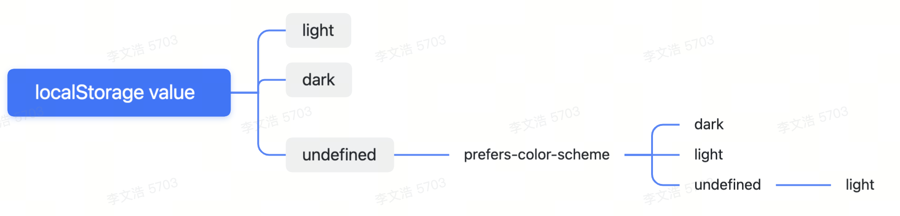

我们创建博客，最难的点应该莫过于添加黑暗模式了

在我们添加黑暗模式前，我们需要定一个我们想要的产品的标准。

a. 用户单击切换亮模式和暗模式。

b. 要保存用户的设置，在用户刷新页面后能访问到正确的主题色。

c. 默认根据用户的操作系统设置设置主题，如果没有设置，则默认的是亮模式。

d. 网站不应该在首次刷新加载时闪烁，即存在主题的过渡显示，即使用户选择了默认的颜色主题。

e. 网站按钮不能有错误的显示状态。

我们绘制下来如图

#### 获取theme的context
首先我们添加一个获取/设置theme的state
```tsx
const [themeMode, setThemeMode] = useState<string>();
```
在页面第一次进入时，我们获取下localStorage下的`themeMode`的value，如果存在的话，我们就设置给theme这个state，否则我们就获取系统下的主题模式。
```tsx
useEffect(() => {
  const localDarkMode = window.localStorage.getItem('themeMode');

  if (localDarkMode) {
    setThemeMode(localDarkMode);
  } else {
    const isDarkMode = window.matchMedia(
      '(prefers-color-scheme: dark)'
    ).matches;
    setThemeMode(isDarkMode ? ThemeModeType.Dark : ThemeModeType.Light);
  }
}, []);
```
然后我们给Provider里再添加一个toggleTheme方法，用于手动改变主题颜色，设置对应的css主题样式, isDarkMode为切换按钮开关的状态。
```tsx
const toggleTheme = (isDakMode: boolean) => {
      const newTheme = !isDakMode ? ThemeModeType.Light : ThemeModeType.Dark;
      setThemeMode(newTheme);
      window.localStorage.setItem('themeMode', newTheme);
      document.body.className = newTheme;

      if (hasWindow) {
        window.__theme = newTheme;
      }
    };
```
这里我们需要注意⚠️：在gatsby ssr构建页面时，window是没办法获取到的（水化），window只能在浏览器环境中获取到，所以我们需要加个类型来判断window是否存在 `typeof window !== 'undefined'`。

然后，我们把创建好的theme上下文添加至页面结构中，这里我们直接包裹Layout组件就好。
```tsx
  return (
    <ThemeProvider>
      <Layout />
    </ThemeProvider>
  );
```
这样theme上下文就成了，我们在组件里调用 `const { toggleTheme } = useContext(ThemeContext);`就可以应用了。

#### 切换主题组件
在我们添加好页面获取和设置theme的上下文后，我们需要创建一个切换主题的button，让用户可以单击切换设置亮暗主题。这里我们借助input checkbox组件的checked属性来进行逻辑上的判读。首先我们通过react的`ref`把input checkbox变成一个受控组件，将其他元素的事件代理到input组件上。
我们的dom结构如下：
```tsx
<div className="toggle-switch" onClick={handleClick}>
  <input
    ref={inputRef}
    type="checkbox"
    className="toggle-switch-checkbox"
    onBlur={handleBlur}
    onFocus={handleFocus}
    aria-label="Switch between Dark and Light mode"
  />
  <div className="toggle-switch-label">
    <span className="toggle-switch-dark">{icon.dark}</span>
    <span className="toggle-switch-sun">{icon.sun}</span>
    <span className={`toggle-switch-switch ${shadowClassName}`} />
  </div>
</div>
```
我们在父元素上添加click，点击click获取当下点击的input的checked状态，执行上下文的方法toggleTheme，并且判断当前的checked与之前的checked是否相等，执行input的click和focus方法。通过focus方法可以触发input得onFocus和onBlur方法，来给`toggle-switch-switch`加高亮的样式。
```tsx
const handleClick = () => {
    const checkbox = inputRef.current;
    onChange?.(checkbox?.checked);
    preCheckbox.current = !!checkbox?.checked;
    if (preCheckbox.current === checkbox?.checked) {
      checkbox?.focus();
      checkbox?.click();
      return;
    }
  };
```
#### 修复页面刷新出现主题闪烁过渡
现在我们页面基本可以进行亮暗主题的切换了。但是随之而来的问题就是在gatsby中，，第一次渲染不会发生在用户的设备中，当react页面首次执行时，我们无法知道用户的颜色偏好是什么，所以会默认为light, 然后react在客户端重新rehydrate水化后将其替换掉，导致页面会刷新会出现由亮至黑的闪烁。
我们真正想要的是，我们在给用户发送html的时候就应该有正确的颜色了。
所以在当我们编译生成页面的html时，在我们内容之前插入一个提前获取颜色的script脚本。
> preformance
> IndexedDB 非常适合存储大块数据（我在Beatmapper中使用它来存储数兆字节的二进制文件！）。对于短字符串，localStorage 是完美的💯
##### 第一种： 利用gatsby构建过程中的暴露方法 在gatsby中更新html
当gatsby构建时会为我们的网站的每个页面生成一个html文件，我们需要在该内容之上注入一个script脚本，以便浏览器能先解析它。
在`gatsby-ssr.tsx`中添加 `setPreBodyComponents`方法。这里的onRenderBody方法
```tsx
export function onRenderBody({ setPreBodyComponents }) {
  setPreBodyComponents(<MagicScriptTag />);
}

```
`MagicScriptTag`就是我们添加的script脚本组件，判断浏览器储存的主题色，给body加上亮模式样式或暗模式样式，具体代码:[gatsby.ssr.tsx](https://github.com/lovexueorangecat/overpurple.io/blob/master/gatsby-ssr.tsx)
并且我们在脚本中注入了一个全局方法, 在浏览器控制台直接可以 `window.__setThemeMode('dark')`来切换暗模式.
```tsx
function setTheme(newTheme) {
    window.__theme = newTheme
    preferredTheme = newTheme
    document.body.className = newTheme
  }
  window.__setThemeMode = function(newTheme) {
    setTheme(newTheme)
    try {
      window.localStorage.setItem('themeMode', newTheme)
    } catch (err) {}
  }
```
请记住初始渲染发生在编译云中，因此最开始的themeMode一定是undefined，每个用户都会获得相同的HTML，这个html的复选框开始将始终未选中。我们最好的办法是推迟渲染切换，判断获取的themeMode不存在时就返回null，直到React应用程序知道themeMode是什么颜色。
这里我们的脚本通过`terser`包来进行压缩。
> 注意⚠️： terser的版本要小于5.x,因为5.x以上的版本的获取压缩后的code方法不一样。
##### 第二种：自定义 html.js
不使用 gatsby-ssr.js 中的 api, 可以自己创建一个自定义 html.js 文件。[Customizing html.js](https://www.gatsbyjs.com/docs/custom-html/)
gatsby使用react组件来处理gatsby core应用程序外部HTML的`<head>`和其他部分。大多数站点使用gatsby附带默认的 html.js。

如果需要自定义站点的html.js，运行一下命令将默认的html.js复制到源代码中，然后根据需要进行修改：
```node
cp .cache/default-html.js src/html.js
```
> 当在 gatsby-ssr.js 中无法使用适当的 API 时，自定义 html.js 是一种变通解决方案。考虑使用 onRenderBody 或 onPreRenderHTML 代替上述

如果您看到此错误：Uncaught Error: _registerComponent(...): Target container is not a DOM element。这意味着您的 html.js 缺少所需的“目标容器”。在你的 `<body>` 中，你必须有一个 id 为 `___gatsby` 的 div，例如：
src/html.js中
```tsx
<div
  key={`body`}
  id="___gatsby"
  dangerouslySetInnerHTML={{ __html: this.props.body }}
/>
```
自定义javascript, 将我们的获取颜色设置颜色的脚本，放进`__html`中。
```js
<script
  dangerouslySetInnerHTML={{
    __html: `
      var name = 'world';
      console.log('Hello ' + name);
    `,
  }}
/>
```