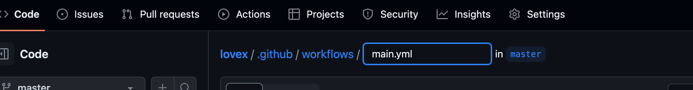
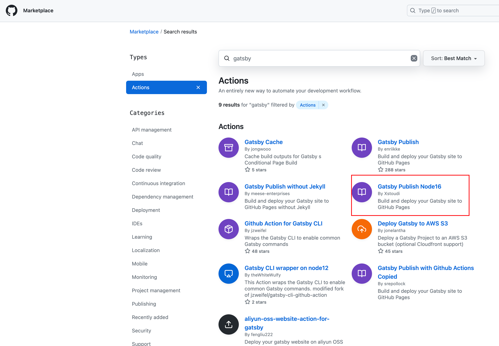

在看到Dan的[overreact.io](https://overreacted.io/)时，我的眼睛瞬间被吸引，优雅真是太优雅了，所以我迫不及待想搭建一个类似的博客网站。

> 搭建需要的工具链
> Gatsby 
#### 开始搭建
本博客是直接在blog模版[gatsby-starter-blog](https://www.gatsbyjs.com/starters/gatsbyjs/gatsby-starter-blog/) 的基础上搭建而成的。

首先我们使用命令来创建，自定义你的项目名
```js
npx gatsby new 你的项目名 https://github.com/gatsbyjs/gatsby-starter-blog
```
创建完成后 `cd到你的项目文件夹`，运行 `yarn develop` 即可在浏览器 `http://localhost:8000/` 显示项目模版内容

#### 修改目录结构
首先我们在 `style.css` 将主题自定义成我们自己的样式
- 为了方便和美观将默认的content/blog文件放进src中，更改`gatsby-config-js`中`gatsby-source-filesystem`的path指向为src。
#### 使用ts
引入typescript 并且创建tsconfig.json
```js
yarn add -D typescript && npx tsc --init
```
具体配置详见: [tsconfig.json](https://github.com/guho-lovex/overpurple.io/blob/master/tsconfig.json)
#### 配置Eslint和prettier
Eslint规范typescript和react

* 安装依赖
```js
yarn add eslint @typescript-eslint/parser @typescript-eslint/eslint-plugin eslint-plugin-react eslint-plugin-react-hooks eslint-plugin-import
```
> eslint: eslint核心代码
> @typescript-eslint/parser: esLint 的解析器，解析 TypeScript，检查和规范 TypeScript 代码；
> @typescript-eslint/eslint-plugin: esLint 插件，包含了定义好的检测 TypeScript 代码的规范。
> eslint-plugin-react： 校验 React
> eslint-plugin-react-hooks： 根据 Hooks API 校验 Hooks 的使用
> eslint-plugin-import: 此插件主要为了校验 import/export 语法，防止错误拼写文件路径以及导出名称的问题 进行排序
根目录下新建`.eslintrc.js`，具体配置如[.eslintrc.js](https://github.com/guho-lovex/overpurple.io/blob/master/.eslintrc.js)，

* 配置prettier
在.vscode/settings.json中新增一个属性，保存自动格式化
```json
{
  "editor.formatOnSave": true
}
```
安装依赖
```js
yarn add prettier eslint-config-prettier eslint-plugin-prettier
```
> prettier: 格式化规则程序
> eslint-config-prettier: 禁用所有和 Prettier 产生冲突的规则
> eslint-plugin-prettier: 把 Prettier 应用到 Eslint，配合 rules "prettier/prettier": "error" 实现 Eslint 提醒。
根目录下新建`.prettierrc`和`.prettierignore`,具体配置如[.prettierrc](https://github.com/guho-lovex/overpurple.io/blob/master/.prettierrc)、[.prettierignore](https://github.com/guho-lovex/overpurple.io/blob/master/.prettierignore)

#### 配置husky和lint-staged构建提交校验
安装依赖
```js
yarn add -D husky lint-staged
```
配置husky的pre-commit钩子
```js
npx husky install
```
会在根目录生成.husky文件，生成文件后，我们需要在husky的钩子监听pre-commit后，执行我们自定义的语法检查
```js
npx husky add .husky/pre-commit 'yarn check-type && yarn lint-staged'
```
在package.json文件中添加如下脚本
```json
"scripts": {
    "lint": "eslint --ext js,jsx,ts,tsx .",
    "check-type": "tsc --noEmit"
  },
  "lint-staged": {
    "*.{js,jsx,ts,tsx}": [
      "eslint --fix"
    ]
  }
```
#### 配置tailwindcss
将tailwind作为PostCss插件安装是将其与构建工具集成的最无缝方式
具体的配置路径：[Get started with Tailwind CSS](https://tailwindcss.com/docs/installation/using-postcss)
- 安装tailwindcss并且创建`tailwind.config.js`
```
npm install -D tailwindcss postcss autoprefixer
npx tailwindcss init
```
- 添加`tailwindcss`和`autoprefixer`到`postcss.config.css`
```js
module.exports = {
  plugins: {
    tailwindcss: {},
    autoprefixer: {},
  }
}
```
- 配置模版路径
```js
module.exports = {
  content: [
    './src/pages/**/*.{js,jsx,ts,tsx}',
    './src/components/**/*.{js,jsx,ts,tsx}',
  ],
  theme: {
    extend: {},
  },
  plugins: [],
}

```
- 将tailwind指令添加到全局css中
```
@tailwind base;
@tailwind components;
@tailwind utilities;
```
- yarn dev后就可以正常使用tailwindcss了

#### 将本地搭建好的项目推送至github
- 检查是否生成密钥
ls有两个文件，id_rsa.pub就是公钥
```s
cd ~/.ssh
ls
```
如果没有生成，则通过命令回车生成ssh key
```s
$ ssh-keygen -t rsa -C "github登录邮箱email@example.com"
```
github添加ssh：settings -> SSH and GPG KEYS, 点击New SSH key, 把id_rsa.pub的内容复制到key中

- 然后在github上创建一个new github仓库
- 在本地项目中创建一个git仓库
```
git init
```
提交本地代码至git
```
git add .
git commit -m "XXX"
```
将main改至master
```
git branch -M master
```
将本地仓库关联到github上
```
git remote add origin 你的github仓库地址
```
将本地仓库所有内容推送至远程库
```
git push -u origin master
```
#### 创建黑暗模式
这里详见另一篇博文：[The pursuit of perfect dark patterns](https://guho-lovex.github.io/overpurple.io/the-pursuit-of-perfect-dark-patterns)

本地仓库推到github仓库
create a new repository on the command line
```
git init
git add README.md
git commit -m "first commit"
git branch -M master
git remote add origin github仓库ssh/https地址
git push -u origin master
```
or push an existing repository from the command line
```
git remote add origin github仓库ssh/https地址
git branch -M master
git push -u origin master
```
srr serve与client 页面路径不匹配时（没有正确水合 hydrate ），这导致 gatsby develop 和 gatsby build 不一致。排查是否使用了window及其的方法，如果有，我们需要将获取放在useEffect中，保证代码不会执行，除非在浏览器中。详见：[Debugging HTML Builds]('https://www.gatsbyjs.com/docs/debugging-html-builds/')
#### 使用Github Actions自动化部署
Github Actions是github提供的免费的自动化构建部署，用于构建、测试和部署应用代码的平台

在仓库中设置Github Actions
点击仓库中的Actions选项卡，点击set up workflow yourself,如图所示

会自动在根目录下创建一个`.github/workflows/main.yml`文件，我们可以修改文件名为`overpurple.yml`

在[Github Actions市场](https://github.com/marketplace?type=actions)有很多预制的action，这里我们选择的是里的Gatsby Publish Node16

点击Gatsby Publish Node16进去，我们将里面的使用代码粘贴进项目的`overpurple.yml`文件中保存。修改为下面code
```yml
name: Overpurple Gatsby Publish

on:
  push:
    branches: 
      - master

jobs:
  build:

    runs-on: ubuntu-latest

    steps:
    - uses: actions/checkout@v3
    - name: Gatsby Publish Node16
      uses: Xstoudi/gatsby-gh-pages-action@v3.0.0
    # - uses: enriikke/gatsby-gh-pages-action@v2
      with:
        access-token: ${{ secrets.OVERPURPLE }}
        deploy-branch: gh-pages
        gatsby-args: --prefix-paths
```
这样就设置了工作流，它将根据yaml文件中定义的触发器运行。然后我push到仓库中，在每次代码提交master后就会触发actions
> 这里我们可以遵循一些简单技巧，选择创建适合我们自己的actions
> - 了解问题，在开始构建前，我们确保要解决的问题以及如何解决。
> - 选择正确的技术栈：如使用javascript或 Docker 编写github actions。
> - 利用已有的软件包，如 @actions/core 和 @actions/github，它们提供了与 GitHub Actions 环境和 GitHub API 的简单互动。
> - 在成功创建自己的工作流程后，你有可能想要发布它。无论你是否发布，请确保测试你的 action 是否有潜在的问题或错误。
关于创建自定义action：可参考[官方文档](https://docs.github.com/en/actions/creating-actions)提供的详细信息

* github actions组件介绍
github actions主要由三个主要组件组成：工作流（Workflows）、事件(Events)、任务(Jobs)
- Workflows：定义自动化过程的规则集，它们在 YAML 文件中定义，该文件存储在 .github/workflows 目录中
- Events: 启动工作流。例如，你可以将事件设置为在创建PR或新开issie是运行工作流。要在工作流中定义时间，使用关键字on后跟事件名称
```yml
on:
    issues:
        types: [opened]
    pull_request_target:
        types: [opened]
```
- Jobs: 构成工作流程。默认情况下，任务是同时运行的。要在给定的工作流中定义你的任务，使用关键字jobs，后跟每个人物及其配置的唯一标识符
```yml
jobs:
  build:
    runs-on: ubuntu-latest
    steps:
      - name: Check out repository
        uses: actions/checkout@v2
      - name: Set up Python
        uses: actions/setup-python@v2
        with:
          python-version: 3.10
      - name: Install dependencies
        run: |
          pip install -r requirements.txt
```
如何实现代码QA的自动化，参考文章：[如何使用 GitHub Actions 实现开源项目的自动化](https://www.freecodecamp.org/chinese/news/automate-open-source-projects-with-github-actions/)
