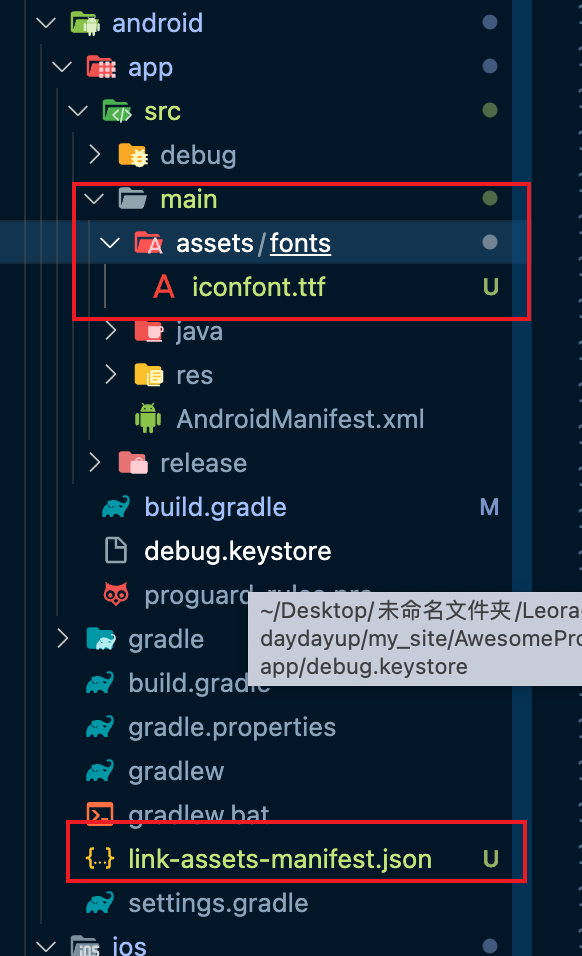
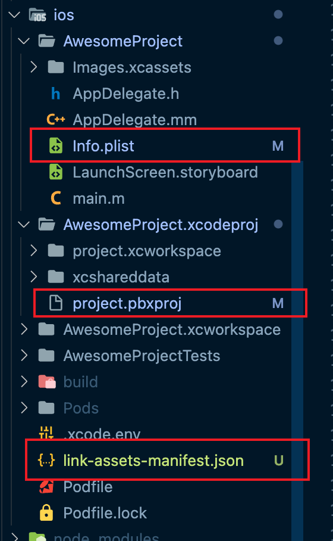

待续...
#### react native 中使用别名alias
在`tsconfig.json`文件中添加解析路径别名使用
```json
{
  "compilerOptions": {
    "baseUrl": ".",
    "paths": {
      "@/*": ["src/*"],
    },
  }
}

```
加入babel插件`babel-plugin-module-resolver`
用于babel打包的时候解析路径别名使用，不配置的话，运行时找不到文件报错
```js
yarn add  -D babel-plugin-module-resolver
```
编辑`babel.config.js`配置插件
```jsx
module.exports = {
  ...
  plugins: [
    [
      'module-resolver',
      {
        alias: {
          '@': './src',
        },
      },
    ],
  ],
};

```
配置好上面后，运行下面命令进行验证
```
yarn start --reset-cache
```
`--reset-cache`是用来标记清除缓存的，一定要加上，不然配置不生效
参考[reactnativeschool](https://www.reactnativeschool.com/how-to-setup-path-alias-in-a-react-native-typescript-app)

#### Debugger
使用`react-devtools`工具 详情见[react-devtools](https://www.npmjs.com/package/react-devtools)
安装
```shell
# Yarn
yarn global add react-devtools
or
# NPM
npm install -g react-devtools
```
如果您希望避免全局安装，则可以添加react-devtools为项目依赖项
```shell
yarn add --dev react-devtools
```
使用npm你可以使用npx
```shell
npx react-devtools
```
与react native 一起使用
```shell
react-devtools
```

#### 使用自定义图标库[inconfont](https://www.iconfont.cn/)
##### 下载iconfont图标文件，直接下载文件然后解压在本地。

将解压的文件放在项目`src/assets/fonts`目录下。
react native 所需的图标其实只需要 `.ttf`文件就可以了。其余的文件直接删除。
在`.json`文件中查看图标的`uniconde`，用来引用使用。

##### link 字体图标文件到ios/android文件夹下
> ⚠️ 注意：由于自动链接，链接和未链接命令(react-native autolink/link/unlink)已在React Native 0.69中删除，我们使用插件`react-native-asset`来自动链接。
```shell
yarn add -D react-native-asset
```
根目录下新建`react-native.config.js`,将存放字体图标的路径放入assets中
```js
module.exports = {
  assets: ['./src/assets/fonts/'],
};

```
然后
使用`npx react-native-asset`来执行link字体库

这里要注意⚠️，配置好了之后我们会在android和ios文件夹下看到如下更改

在`android/app/build.gradle`中添加如下code
```js
// 自定义的字体文件需要在这里赋值声明，如果有多个都需要添加到数组中
project.ext.vectoricons = [
    iconFontNames: [ 'iconfont.ttf' ]
]
```


<b>当更改了`.ttf`字体文件后，需要重新启动应用</b>
```js
yarn ios
// or
yarn android
```
<b>最后重启编译运行项目 `yarn react-native start --reset-cache`</b>
> 如果添加文件后字体图标不显示，则重新启动应用然后再清缓存编译。

3. 使用
```js
<Text style={{ fontFamily: 'iconfont' }}>{'\ue63e'}</Text>
<Text style={{ fontFamily: 'iconfont' }}>{'\ue613'}</Text>
<Text style={{ fontFamily: 'iconfont' }}>{'\ue7c1'}</Text>
```
#### 使用createIconSet函数
使用`react-native-vector-icons`中的`createIconSet`函数创建自定义图标组件
```tsx
import { createIconSet } from 'react-native-vector-icons';
import glyphsMap from '@/utils/iconfontMap.json';

const IconFont = createIconSet(glyphsMap, 'iconfont', 'iconfont.ttf');

export default IconFont;
```
使用
```tsx
//导入组件
import Icon from './js/common/IconFont';
//使用组件
<Icon name='icon_hot' size={20} color='lightgreen' />
```


React Native 的原生依赖项通常是指针对特定平台的本地代码（例如 iOS 和 Android），并且需要在编译应用程序时进行链接。在过去，处理原生依赖项通常需要手动设置和配置，但现在 React Native CLI 已经实现了自动链接功能，使得处理原生依赖项更加简便。

具体来说，React Native CLI 通过检测您的项目中的原生代码和依赖项，自动将它们链接到您的应用程序中。您无需手动设置或更改任何配置文件。

在使用 React Native CLI 时，您只需要在您的项目中安装所需的依赖项，React Native CLI 就会自动链接这些依赖项。您可以在您的代码中轻松使用这些依赖项，并在编译应用程序时自动包含它们的原生代码。

> 参考 [集成到现有原生应用](https://reactnative.cn/docs/integration-with-existing-apps)
组件安装后报错需`pod install`对于ios：
```shell
cd ios
pod install
```